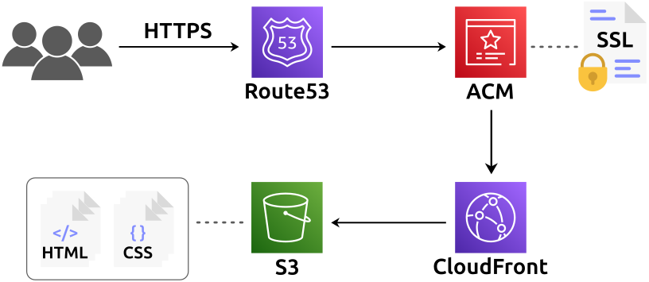

# Static Site Deployment Tool

[](https://opensource.org/licenses/MIT)
[](https://www.python.org)
[](https://aws.amazon.com)

A Python tool that automates the deployment of static websites to AWS.

## Overview

This script provisions and configures everything needed to host a static website on AWS:

- **S3 bucket** (private) to store your site files  
- **CloudFront distribution** to serve content securely  
- **SSL certificate** issued by AWS Certificate Manager  
- **Route53 records** to route your domain to CloudFront  

After the resources are created, your static files are automatically uploaded and served over HTTPS.

<p>
  
</p>

## Quick Start

Clone the repository:

```bash
git clone http://github.com/zack-young-ideas/static-site-deployment-tool
cd static-site-deployment-tool
chmod +x main.py
```

### 1. Create IAM User CloudFormation Template

Generate a CloudFormation template that defines an IAM user with the permissions needed to deploy static sites:

```bash
./main.py iam
```

### 2. Deploy Your Site

Before deploying, make sure:
- The IAM user's **Access Key ID** and **Secret Access Key** are configured for AWS CLI or available to the script
- Your AWS account has a **hosted zone** for your domain
- Your settings file defines `DOMAIN_NAME` and `SOURCE_FILES_DIRECTORY`

Then run:

```bash
./main.py deploy --config=settings_file.py
```

## Configuration

Both commands accept an optional `--config` argument that points to a Python settings file. The `deploy` command requires this file to define your domain and source directory.

Example configuration:

```python
# The name of the CF template that creates a new IAM user.
IAM_USER_TEMPLATE = 'create_iam_template'
# The TEMPLATE_FORMAT variable indicates whether the CF
# template should be in JSON or YAML.
TEMPLATE_FORMAT = 'YAML'

# The directory that contains the site's static files.
SOURCE_FILES_DIRECTORY = 'source_dir'

# The domain name for the site.
DOMAIN_NAME = 'example.com'

# The homepage of the site.
INDEX_FILE = 'index.html'
# The default 404 and 500 error pages.
_404_FILE = '404.html'
_500_FILE = '500.html'

# If REGISTER_DOMAIN is set to True, the IAM user will have the
# permissions needed to purchase and register a new domain name.
REGISTER_DOMAIN = False

# If HTML_EXTENSIONS is set to False, the .html extension will
# be removed from every file; this makes the URLs of the site
# more aesthetic (i.e., /about instead of /about.html).
HTML_EXTENSIONS = False
```

## License

This project is open source and available under the [MIT License](LICENSE).

## Author

Zack Young
